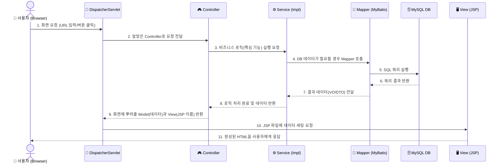

<h1>자바 프로젝트</h1>

<strong>버전</strong>: 전자정부프레임워크 4.3

<strong>모델</strong>: MVC2

<strong>서버</strong>: Tomcat 9.0v

<strong>DB</strong>:   MySQL

<strong>DB초기 설정</strong>: Flyway(8.5.13)

<h2>Java/Spring MVC2 팀 프로젝트 협업 가이드</h2>
본 저장소는 전자정부프레임워크(eGovFrame) 기반의 웹 애플리케이션(ERP 시스템 등) 개발을 위한 캡스톤 프로젝트 저장소입니다. 원활한 팀 협업을 위해 아래의 Git 명령어와 규칙을 반드시 숙지하고 개발을 진행해 주세요.

## 🏛️Spring MVC2 아키텍처 동작 흐름

<h3> 📌 1. 팀 협업 기본 원칙 (매우 중요) </h3>

우리 프로젝트의 `main` 브랜치는 완벽하게 작동하는 베이스캠프입니다. 시스템 보호를 위해 **`main` 브랜치에 직접 코드를 올리는 것(Push)은 금지되어 있습니다.**

1. 무조건 본인의 기능 이름으로 **새 브랜치를 생성**하여 작업합니다. (예: `feature/login`, `update-page`)

2. 작업이 완료되면 깃허브 웹사이트에서 팀장에게 **Pull Request(PR)** 를 요청합니다.

3. 팀장의 코드 리뷰 및 **승인(Approve)** 이 완료되어야만 `main`에 코드가 병합(Merge)됩니다.

 
<h3>💻 2. 단계별 핵심 Git 명령어</h3>

<h4>[1단계] 프로젝트 처음 시작할 때 (최초 1회)</h4>

저장소의 코드를 내 PC(이클립스 워크스페이스)로 통째로 가져옵니다.

<strong>git 명령어</strong>

git clone https://github.com/codakcoo/javaproject.git

참고: 이클립스에서 가져올 때는 Import -> Existing Maven Projects 로 불러와야 합니다.

 
<h4>[2단계] 내 작업 시작하기 (브랜치 생성)</h4>

가져온 폴더 안으로 이동(cd javaproject)한 후, 내 작업방을 만들고 이동합니다.

최신 상태 업데이트 후, 새로운 브랜치 생성 및 이동

git pull origin main

git checkout -b 자신이지정할브랜치이름

 
<h4>[3단계] 코드 저장 및 업로드</h4>

기능 개발이 끝났거나 중간 저장이 필요할 때 깃허브로 코드를 쏘아 올립니다.

git add . 

git commit -m "feat: OOO 기능 구현 및 폼 UI 완성" 

git push origin feature/내기능이름 

 
<h4>[4단계] 다른 팀원이 올린 최신 코드 반영하기</h4>

내 코드를 짜기 전, 또는 작업 중간에 수시로 main의 최신 상태를 내 컴퓨터로 가져옵니다.

git checkout main

git pull origin main

 
<h3>🗑️ 3. .gitignore 설정 및 캐시 초기화 (충돌 방지)</h3>

이클립스 개인 설정 파일(.classpath, .project 등)이 깃허브에 올라가면 팀원 간 Merge Conflict(병합 충돌) 가 발생합니다. 만약 이미 찌꺼기 파일이 깃허브에 올라갔다면, 아래 명령어를 통해 Git의 기억을 지우고 블랙리스트를 다시 적용해야 합니다.

<strong>[Git 캐시 삭제 및 .gitignore 재적용 명령어]</strong>

1. Git의 추적 목록에서 파일들 임시 삭제 (실제 파일은 지워지지 않음)

git rm -r --cached . 

2. .gitignore가 적용된 상태로 순수 소스코드만 다시 장바구니에 담기

git add .

3. 확정 도장 찍기

git commit -m "chore: gitignore 세팅 및 불필요한 설정 파일 캐시 삭제"

4. 깃허브에 올리기

git push origin 현재브랜치명

 
<h3>💡 4. 자주 겪는 에러 및 해결법 </h3>

fatal: not a git repository

원인: 현재 터미널 위치가 프로젝트 폴더(.git이 있는 곳) 내부가 아닙니다.

해결: cd 폴더명 명령어로 프로젝트 내부로 한 칸 들어갑니다.

 

fatal: 'origin' does not appear to be a git repository

원인: 깃허브 서버 주소(origin) 연결이 끊어졌습니다.

해결: git remote add origin https://github.com/codakcoo/javaproject.git 입력하여 재연결.

 
<h4>추신</h4>

깃(Git)이 이 주소록을 컴퓨터의 임시 기억 장치(RAM)에 잠깐 외워두는 것이 아니라, 프로젝트 폴더 안의 숨겨진 파일에 진짜 텍스트로 꾹꾹 눌러 적어둔다.

실제로 어디에 적혀있는지 직접 두 눈으로 확인해 보실 수 있다.

방금 작업하시던 프로젝트 폴더 안을 봅니다. (윈도우 탐색기에서 '숨긴 항목 보기'가 켜져 있어야 합니다.)

.git 이라는 이름의 폴더가 있습니다. 그 안으로 들어갑니다.

config 라는 이름의 파일이 있습니다. 이 파일을 마우스 우클릭해서 '메모장'으로 열어보세요.

그러면 파일 안에 아래와 같은 내용이 또렷하게 적혀있는 것을 보실 수 있습니다.

[remote "origin"]

&emsp;url = https://github.com/codakcoo/javaproject.git

&emsp;fetch = +refs/heads/*:refs/remotes/origin/*

 

<h3>git 명령어</h3>

<h3>진행상황</h3>
<h5>로그인 화면</h5>

<h5>회원가입 화면</h5>

<h5>메인 화면</h5>

<h5>직원관리</h5>

<h5>전자결재</h5>

---
<h3>DB 설정</h3>
## 🗄️ 5. 데이터베이스(DB) 세팅 및 자동화 가이드

우리 프로젝트는 로컬 환경의 **MySQL**을 데이터베이스로 사용하며, 팀원 간의 완벽한 DB 구조 동기화를 위해 **Flyway**를 도입하여 테이블 생성을 자동화했습니다. 팀원 여러분은 아래의 개념과 규칙을 숙지해 주세요.

### 🐬 MySQL (데이터베이스 서버)
MySQL은 데이터를 저장하는 '건물(사무실)'과 같습니다. 프로젝트를 구동하기 위해 각자의 PC에 무조건 설치되어 실행 중이어야 합니다.

* **팀원 필수 세팅:**
  1. 로컬 PC에 MySQL을 설치하고 실행합니다.
  2. MySQL에 접속하여 빈 데이터베이스(예: `javaproject`)를 딱 하나만 생성해 둡니다. (테이블은 직접 만들 필요가 없습니다!)
  3. `context-datasource.xml` 또는 `globals.properties` 파일에 본인 PC의 MySQL 접속 계정(ID/PW)을 맞게 설정합니다.

### 🦅 Flyway (DB 마이그레이션 도구)
Flyway는 빈 건물(MySQL)에 들어가서 책상을 세팅하는(CREATE TABLE, ALTER, DROP) '자동 정의'입니다. 

팀원들이 이클립스에서 톰캣(Tomcat) 서버를 켜는 순간, Flyway가 자동으로 작동하여 최신 DB 구조를 각자의 PC에 똑같이 세팅해 줍니다. 따라서 테이블이 없거나 구조가 달라서 에러가 나는 일이 발생하지 않습니다.

* **작동 원리:**
  * 프로젝트의 `src/main/resources/db/migration` 폴더에 있는 SQL 파일들을 버전(`V1`, `V2`...) 순서대로 읽어서 자동으로 실행합니다.
  * 이미 실행된 버전은 Flyway가 자체적으로 기억(History)하여 중복 실행하지 않고, 새롭게 추가된 버전의 SQL 파일만 똑똑하게 실행합니다.

---

### 🚨 [중요] DB 테이블 구조를 변경(추가/수정)할 때 규칙

**기존에 작성된 V1, V2 파일은 절대! 네버! 수정하거나 삭제하지 마세요.**
(과거의 파일을 수정하면 Flyway의 기억 장부와 충돌하여 서버가 켜지지 않습니다.)

테이블에 컬럼을 추가하거나 새로운 테이블을 만들어야 한다면, **반드시 새로운 버전의 SQL 파일을 생성**해야 합니다.

**[SQL 파일 네이밍 규칙]**
1. 파일 위치: `src/main/resources/db/migration`
2. 파일 이름: `V숫자__설명.sql` (반드시 **대문자 V** + **숫자** + **언더바 2개(__)** 형식 준수)
3. 예시:
   * `V1__init.sql` (최초 테이블 생성)
   * `V2__add_email_to_member.sql` (회원 테이블에 이메일 컬럼 추가 시)
   * `V3__create_board_table.sql` (게시판 테이블 신규 생성 시)

새로운 `V숫자__xxx.sql` 파일을 만들고 깃허브에 올리면(Push), 다른 팀원들은 코드를 내려받고(Pull) 서버를 켜기만 하면 자동으로 본인 PC의 DB에 해당 변경사항이 적용됩니다.

## ⚙️ 서버 구동 및 초기 데이터 자동 세팅 흐름

우리 프로젝트는 개발 편의성과 보안을 모두 챙기기 위해, 톰캣(Tomcat) 서버가 켜질 때 다음과 같은 순서로 초기 데이터가 자동 세팅됩니다. 

**[자동 세팅 프로세스 4단계]**

1️⃣ **Tomcat 서버 시작**
 
2️⃣ **Flyway 실행 (테이블 및 일반 데이터 구축)**
   * `db/migration` 폴더의 SQL 파일들을 읽어 테이블을 자동 생성합니다.
   * ⚠️ **[데이터 추가 규칙 1]** 상품, 부서, 공통 코드 등 **보안(암호화)이 필요 없는 샘플 데이터**는 무조건 이 SQL 파일 안에 `INSERT` 문으로 작성해 주세요.
 
3️⃣ **DataInitializer 실행 (보안 데이터 구축)**
   * **위치:** `src/main/java/egovframework/common/DataInitializer.java`
   * Flyway 실행 직후, Spring의 `@PostConstruct`를 통해 자동으로 Java 코드가 실행됩니다.
   * ⚠️ **[데이터 추가 규칙 2]** 회원 정보 등 **비밀번호(BCrypt) 암호화가 필수적인 민감 데이터**는 절대 SQL 파일에 평문으로 넣지 말고, 반드시 이 `DataInitializer.java` 파일 안에서 암호화 처리 후 삽입해 주세요.
4️⃣ **구동 완료 및 즉시 로그인 가능!**
   * 서버 구동이 완료되면, 추가 설정 없이 즉시 아래의 기본 관리자 계정으로 테스트 로그인이 가능합니다.
   * **테스트 계정:** `admin` / **비밀번호:** `1234`
 

<h5>데이터베이스 및 Flyway 기록 지우는 코드 파일</h5>
https://drive.google.com/file/d/1iUmnTNMYtp8U5IakJPACHnHa-y75s-9V/view?usp=drive_link
